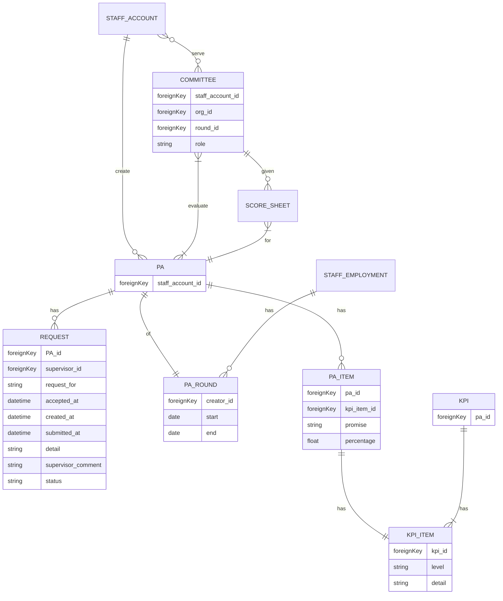

```mermaid
erDiagram
    STAFF_ACCOUNT ||--o{ PA : create
    PA ||--o{ REQUEST : has
    PA ||--|| PA_ROUND : of
    STAFF_EMPLOYMENT ||--o{ PA_ROUND : has
    COMMITTEE }|--|{ PA : evaluate
    STAFF_ACCOUNT }o--o{ COMMITTEE : serve
    COMMITTEE ||--o{ SCORE_SHEET : given
    SCORE_SHEET }|--|| PA : for
    PA ||--o{ PA_ITEM : has
    PA_ITEM ||--|| KPI_ITEM : has
    
    KPI ||--|{ KPI_ITEM : has
    
    KPI {
        foreignKey pa_id
    }
    
    KPI_ITEM {
        foreignKey kpi_id
        string level
        string detail
    }
    
    PA_ITEM {
        foreignKey pa_id
        foreignKey kpi_item_id
        string promise
        float percentage
    }
    
    COMMITTEE {
        foreignKey staff_account_id
        foreignKey org_id
        foreignKey round_id
        string role
    }
    
    PA_ROUND {
        foreignKey creator_id
        
        date start
        date end
    }
    REQUEST {
        foreignKey PA_id
        foreignKey supervisor_id
        
        string request_for
        datetime accepted_at
        datetime created_at
        datetime submitted_at
        string detail
        string supervisor_comment
        string status
    }
    
    PA {
        foreignKey staff_account_id
        
        
    }
```
